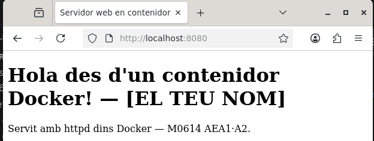

# AEA1 — Servidors web

**Alumne:** Nom i cognoms
**Branca:** aea1

## A1 · Servidor Apache (localhost)

### Passos realitzats
1. Actualització de paquets: `sudo apt update`
2. Instal·lació: `sudo apt install apache2 -y`
3. Comprovació del servei: `sudo systemctl status apache2`
4. Publicació de la meva pàgina a `/var/www/html/index.html`

### Fitxers de configuració d'Apache identificats
- `/etc/apache2/apache2.conf` — configuració principal
- `/etc/apache2/ports.conf` — ports d'escolta
- `/var/www/html/` — arrel del document

### Verificació
- `curl -I http://localhost` retorna `200 OK`
- Pàgina visible al navegador a http://localhost

### Captures

## A2 · Servidor web en contenidor Docker

### Decisió: imatge triada
He fet servir `httpd` (o `nginx`) perquè... [justificació breu]

### Passos realitzats
1. Descàrrega de la imatge: `docker pull httpd:latest`
2. Contenidor amb volum i mapatge de ports:
   `docker run -d --name web-aea1 -p 8080:80 -v "$(pwd)/web":/usr/local/apache2/htdocs/ httpd:latest`
3. Comprovació: `docker ps`

### Verificació
- `curl -I http://localhost:8080` retorna `200 OK`
- Pàgina visible al navegador a http://localhost:8080

### Captures

