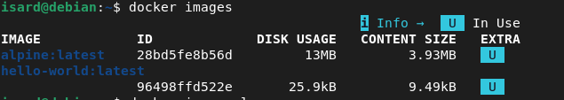
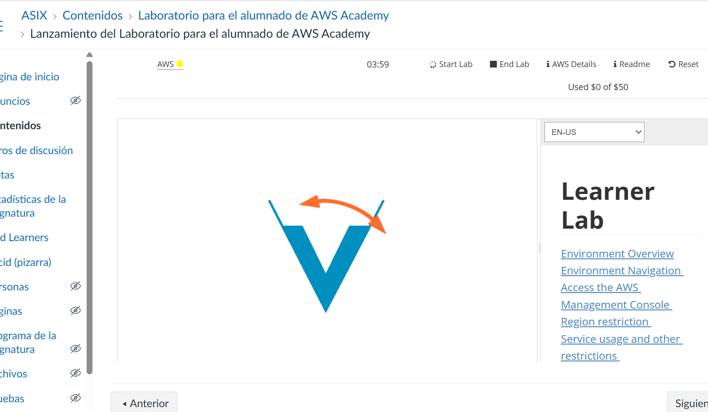

# AEA0 — Preparació de l'entorn

**Alumne:** Nom i cognoms
**Branca:** aea0

## A1 · Git i GitHub

### Passos realitzats
1. Instal·lació i comprovació de Git: `git --version`
2. Configuració de l'usuari: `git config --global user.name` i `user.email`
3. Creació del compte de GitHub i identificació de VS Code amb el meu usuari
4. Clonatge del repositori i creació de la branca `aea0`: `git switch -c aea0`
5. Primer commit i publicació: `git push -u origin aea0`

### Entorn de treball
- **Sistema operatiu:** Ubuntu
- **Editor:** Visual Studio Code (amb terminal integrada)
- **Versió de Git:** git version 2.x.x

### Verificació
- `git log --oneline` mostra el commit fet
- La branca `aea0` és visible a GitHub

## A2 · Docker

### Passos realitzats
1. Afegir la clau i el repositori oficials de Docker
2. Instal·lació: `sudo apt install docker-ce docker-compose-plugin`
3. Executar sense sudo: `sudo usermod -aG docker $USER`

### Versions instal·lades
- `docker --version` → Docker version 27.x.x
- `docker compose version` → Docker Compose version v2.x.x

### Proves
- `docker run hello-world` → mostra "Hello from Docker!"
- `docker run alpine echo "El meu primer contenidor Alpine"`

### Imatge vs. contenidor
- **Imatge:** plantilla de només lectura amb l'aplicació
- **Contenidor:** instància en execució creada a partir d'una imatge

### Verificació
- `docker images` mostra les imatges `hello-world` i `alpine`

## A3 · AWS Academy

### Accés a la consola
1. Acceptar la invitació i entrar a AWS Academy (Canvas)
2. Iniciar el laboratori: Learner Lab → *Start Lab* (indicador verd)
3. Obrir la consola fent clic a *AWS* (ja autenticada)

- **Regió de treball:** us-east-1 (N. Virginia)

### Estructura del repositori
La feina s'organitza amb una branca per AEA:
- `aea0` — preparació de l'entorn (Git/GitHub, Docker, AWS)
- `aea1`, `aea2`, ... — la resta d'unitats

### Captura
